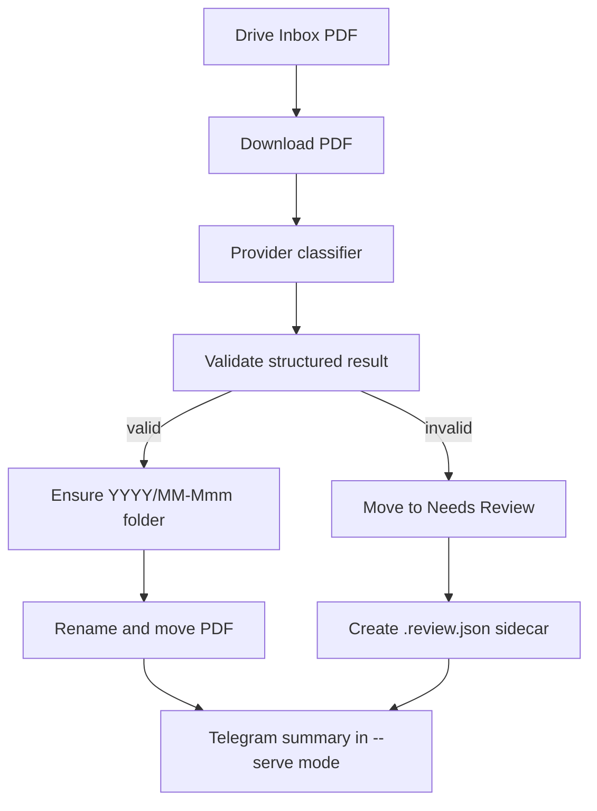

# Architecture

## Runtime Entrypoints

- `bot.py`: stable local entrypoint.
- `python -m receipt_sorter`: package entrypoint.
- `receipt_sorter.app.main`: CLI parser and runtime dispatcher.

Default runtime is one-shot mode. `--serve` starts the long-lived Drive poller and Telegram listener.
If the Telegram listener fails three times in server mode, the listener task exits
cleanly, marks the session as Drive-only degraded, and leaves the Drive poller running.

## Package Map

```text
receipt_sorter/
  ai.py                Provider-facing protocols and document input models
  app.py               CLI, runtime orchestration, one-shot/server modes
  config.py            Environment parsing and validation
  corrections.py       Telegram correction prompt input construction
  drive.py             Sync Drive helpers and async Drive client wrapper
  formatting.py        Filenames and Telegram summary formatting
  log.py               Timestamped console logging
  memory.py            MEMORY.md read/update helpers
  models.py            Structured document/correction/result models
  openai_provider.py   OpenAI classifier and correction parser
  processor.py         One-file processing pipeline
  prompts.py           Classifier and correction system prompts
  provider_factory.py  Provider construction from config
  telegram_bot.py      Telegram commands, uploads, corrections, summaries
  validation.py        Classification validation rules
```

## Data Flow



## Provider Boundary

Core runtime depends on protocol-style interfaces from `ai.py`, not directly on OpenAI. OpenAI-specific behavior such as Files API uploads, Agents SDK usage, structured outputs, prompt caching, and cache usage logging stays in `openai_provider.py`.

Future providers should implement the same high-level classifier and correction parser contracts without changing Drive or Telegram code.

## Drive Boundary

`drive.py` keeps synchronous Google API helpers for setup scripts and wraps runtime Drive operations in `asyncio.to_thread` through `AsyncDriveClient`. This keeps Telegram handling from being blocked by Drive I/O in server mode.
